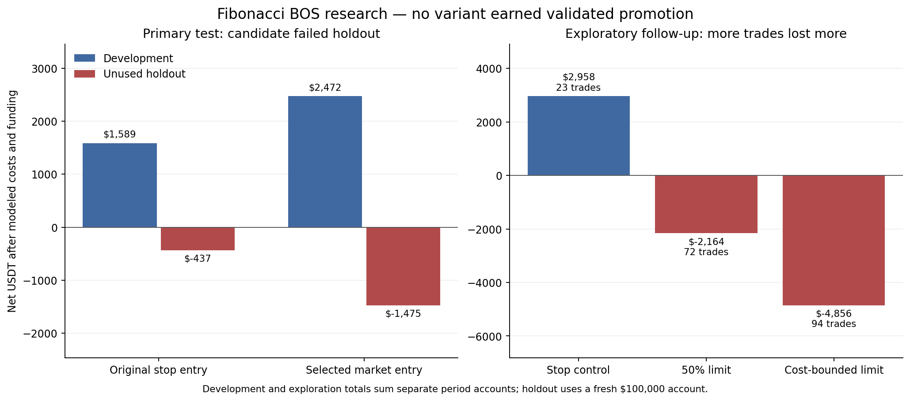

# Fibonacci competition research: no validated upgrade

The broad comparison did not justify promoting a new trading rule. The original entry remains the control. Increasing trade count by entering sooner or placing limits did not establish a more profitable strategy. Pine v4 incorporates cost accounting and explicit test dates, without promoting rejected entry variants.



## Data and external research

Collected 45 months, January 2023–September 2026, from official Binance BTCUSDT USD-M futures archives: **131,424 signal candles**, **394,272 five-minute execution candles**, **4,107 actual funding events**, and **135 SHA256-verified archives**. Raw archives remain outside Git in `/workspace/fibonacci-competition-data`. Every report records input hashes; no market data was fabricated.

Primary sources:

- [Binance public-data documentation](https://github.com/binance/binance-public-data): futures candle columns, archive layout and SHA256 checksums.
- [Official futures archive](https://data.binance.vision/?prefix=data/futures/um/monthly/): 15m/5m BTCUSDT candles and monthly `fundingRate` events.

The official 15m archive disagreed with the corresponding 5m aggregate at three development timestamps: 2023-11-10, 2024-10-28 and 2025-01-29. Independent official 1m archives agreed with the 5m prices. The study therefore uses canonical 15m signals aggregated from verified 5m candles throughout, rather than mixing inconsistent resolutions. Exact timestamps and both OHLC versions are published in the JSON quality sections. Checksum verification authenticates archive integrity; it cannot establish that all archived prices are accurate.

These are Binance prices, not venue-exact Bitunix execution. Official funding rates are applied to positions carried into settlement, using the contemporaneous traded-candle open as a mark-price proxy. Fees are 0.07% per side: 0.06% assumed exchange commission plus an extra 0.01% execution reserve. That reserve is an assumption, not measured spread. All candidates use 0.25% planned equity risk, 95% notional cap, maximum 1 BTC, no leverage, and the same sizing allowance and fixed structure stop.

## Primary comparison: declared, frozen, then tested

The [protocol](../../competition/protocol.json) and eight candidates were committed before inspecting the new data (`91597d6`). The canonical-data amendment was committed before producing strategy results (`11f43b6`). Development used history beginning January 2023 and three independent-account evaluation folds: 2024 H1, 2024 H2 and 2025 H1. Prior history warms indicators and confirmed pivots; positions and account equity do not cross fold boundaries.

All candidates retain the first pullback, closed 4h EMA trend, confirmed BOS, fixed buffered pullback stop, 1.5 minimum net R and two-candle rejection window. The finite comparison tests pivot 3 versus 5, a 38.2% versus 50% pullback, next-open rejection entry versus rejection-high/low stop entry, and a 127.2% extension versus the original impulse-extreme target. Combinations were explicitly declared, not generated by a large grid search.

| Candidate | Evaluation trades | Aggregate net USDT | Aggregate PF | Eligible |
|---|---:|---:|---:|---|
| Original v3 stop entry | 15 | +1,588.74 | 1.924 | No: insufficient trades |
| Faster pivot confirmation | 9 | +1,666.16 | 2.942 | No |
| Shallower pullback | 7 | +1,745.98 | 3.824 | No |
| Next-open rejection entry | 33 | +2,471.85 | 1.565 | Yes |
| Extension target | 46 | −1,175.76 | 0.839 | No |
| Faster confirmation + market | 27 | −493.54 | 0.876 | No |
| Shallower pullback + market | 14 | +878.69 | 1.494 | No |
| Faster market + extension | 70 | −8,990.39 | 0.277 | No |

Selection required 30 evaluation trades, aggregate PF >=1.1, two profitable folds, every fold closing-equity drawdown below 5%, and positive net after removing the largest winner. The market-reclaim candidate was the only eligible candidate and was frozen in `48f2159` before accessing July–December 2025 holdout data.

| Untouched holdout, July–December 2025 | Trades | Net USDT | PF | Closing-equity max DD |
|---|---:|---:|---:|---:|
| Original stop entry | 2 | −437.46 | 0.000 | 685.69 |
| Frozen next-open entry | 7 | −1,475.41 | 0.000 | 1,504.02 |

Both failed. The candidate also lost under 0.10% fees and 20-tick slippage stress scenarios. Six of seven losses occurred after the entry's 5m candle, so entry-subbar ambiguity does not explain most of the failure. No rules were retuned on this holdout and then presented as an independently validated improvement.

## Exploratory follow-up: better planned R did not imply better outcomes

After the primary failure, the [follow-up protocol](../../competition/limit_followup_protocol.json) declared two research-only alternatives: a limit at 50% after a closed rejection, and a limit at/deeper than 50% mathematically constrained to offer 1.5 estimated net R while remaining inside the 50–61.8% zone. Neither alternative widens the stop, pushes out the target or increases leverage to manufacture payoff.

This uses **known data**, including the now-used holdout and previously inspected 2026 periods. It is not fresh validation. Seven independent-account runs cover 2024 H1/H2, 2025 H1/H2, and 2026 Q1/Q2/Q3. Totals sum the independent runs, not one uninterrupted live account.

| Entry | Trades | Sum of period net USDT | PF | Profitable periods / 7 |
|---|---:|---:|---:|---:|
| Stop-entry control | 23 | +2,957.97 | 2.140 | 4 |
| Rejection then 50% limit | 72 | −2,164.11 | 0.792 | 3 |
| Rejection then cost-bounded limit | 94 | −4,855.60 | 0.648 | 1 |

The cost-bounded limit incurred $8,058.37 in modeled fees. More frequent fills increased costs and losses. A favorable geometric reward/risk calculation is an entry eligibility check, not evidence that the target will be reached. The control's positive aggregate is based on few trades and includes negative periods; it does not rescue the failed holdout or establish consistency.

## Execution audit and practical limits

- Signal decisions use closed 15m candles; HTF trend uses the previous closed 4h candle. Confirmed pivots are available only after their right-hand bars. No historical signal is backdated.
- Resting orders and brackets replay chronologically through three 5m candles. A low before a later stop-entry fill cannot stop the not-yet-open position. Market signals enter at the next bar open. Limit orders need a subsequent touch and receive no favorable opening-gap improvement.
- On the entry **5m subbar**, OHLC still cannot establish the full price path. Stop-first if both levels touch is conservative. Entry-subbar extremes are checked conservatively after the entry; 1m/tick replay or native bar magnifier could differ.
- Funding applies only to a position carried into its event. Entry/exit commissions and adverse market/stop slippage affect actual equity. Limit fills have no modeled adverse entry slippage. Under-minimum quantities and insufficient cash reject entries.
- Closing drawdown is not true intrabar maximum drawdown. Liquidity, measured bid/ask spreads, partial fills, liquidation mechanics and exchange-specific funding marks are unavailable. Native TradingView compilation/backtesting is not available here.
- Every reported favorable result is a model result, not a guarantee or verified Bitunix result. A future strategy hypothesis requires a new unused validation period. None of the tested entry variants is promoted for live competition.

## Reproduce without overwriting committed records

Standard-library Python 3.10+ for data and tests. Network must permit `data.binance.vision`. Raw data is downloaded outside Git and checked before parsing:

```sh
python3 -B tests/test_fibonacci_breakout_pullback.py
python3 -B tests/test_competition_engine.py
python3 -B tests/test_breakout_execution.py
python3 -B research/competition/study.py development --output /workspace/fib-reproduction
# Review and freeze /workspace/fib-reproduction/frozen_selection.json before running:
python3 -B research/competition/study.py holdout --output /workspace/fib-reproduction
python3 -B research/competition/limit_study.py --output /workspace/fib-limit-reproduction
```

Rerunning known holdout data is reproduction, not a fresh test. There are 18 focused regression checks covering actual Pine entry/cost/date expressions, causal HTF behavior, next-bar entries, funding signs, intrabar order chronology, cost-bound algebra, no-touch limit rejection and corrupted archive rejection. Synthetic fixtures validate implementation only.

`plot_results.py` optionally regenerates PNG/SVG figures with matplotlib; plotting is not required to run backtests. Reports contain configurations, hashes, individual modeled trade/funding logs, holdout equity and quality discrepancies. Both successful and rejected hypotheses are retained.

## Subsequent v5 stop-limit execution audit

The [stop-limit protocol](../../competition/stop_limit_protocol.json) was recorded before the [gap audit](stop_limit_audit.json). It changes execution only: break the rejection trigger first, then apply an adverse fill-price cap consistent with 1.5 modeled net R. It sizes at that cap and preserves the original fixed stop/target. This uses the same known seven research periods and makes no new validation claim.

Both control and capped mode produced 23 trades. Capped mode totaled $2,399.85 net versus $2,957.97 for the control. Sum of independent-period closing drawdowns decreased from $3,077.03 to $2,464.81; the smaller quantities explain much of that decrease. PF was 2.112 versus 2.140. These are sums across period accounts, not continuous portfolio metrics. The feature stays optional and off by default in Pine v5 because it did not improve profit.

The model explicitly distinguishes stop activation from subsequent limit fills. A price touch before activation cannot fill the order. An opening gap past the cap may remain unfilled; a later retrace can fill the active limit. Long and short regression checks cover these sequences. Native TradingView stop-limit fill behavior remains unverified, and 5m path ambiguity remains a limitation.
